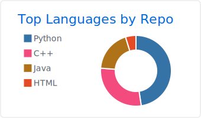
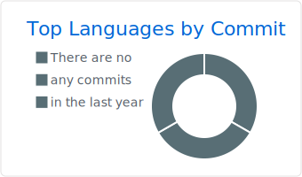
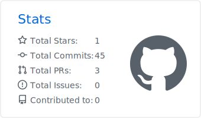

Hey Mahmood here 👋

I am a C/C++ and python Developer who is exploring thies languges in deep. while looking for my first job in the field.

(https://github.com/vn7n24fzkq/github-profile-summary-cards)

 ---
  
 :books: I want to learn Game development and to be axpert in C/C++.
 
  
 💬 Ask me about C/C++ and python Development, and any Tech-related stuff.

  

---

### Languages, Tech & Tools Preference

              

---

### You can find in me in the web 🌍
[][linkedin]

 

---

Let's connect 👨‍💻 and forge the future together.😁

[linkedin]: https://www.linkedin.com/in/mahmood-qawasmi

